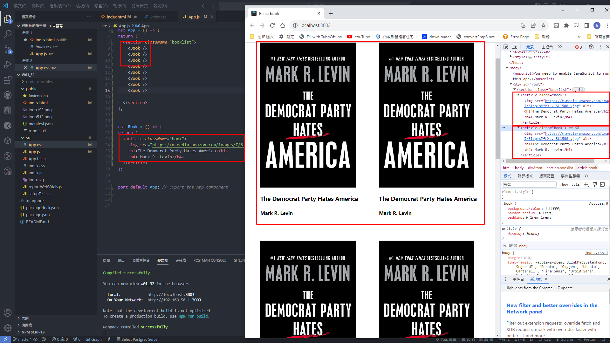

### w01-p1: create github repo with demo/md/w01_32 directory

### w01-p2: display first two book/>

### w01-p3: Display first <Book_32/>

### W01-P4: Display three different <Book_32 />, and show third <Book_32> in Chrome DevTools

