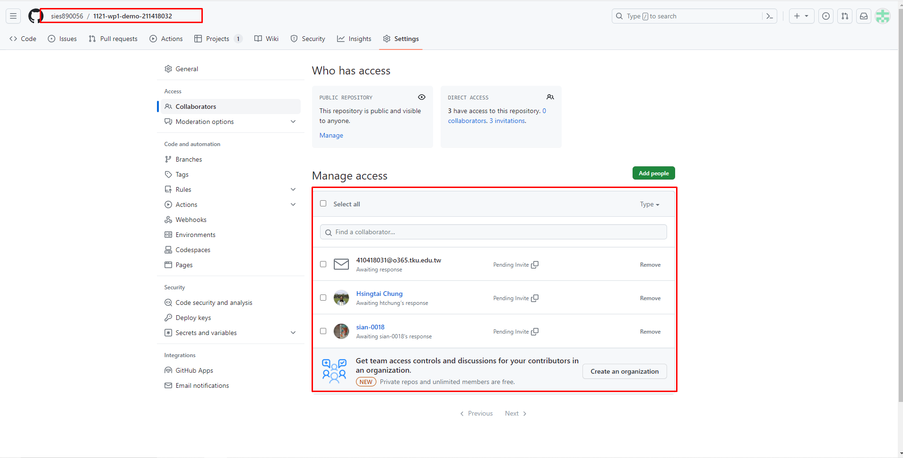
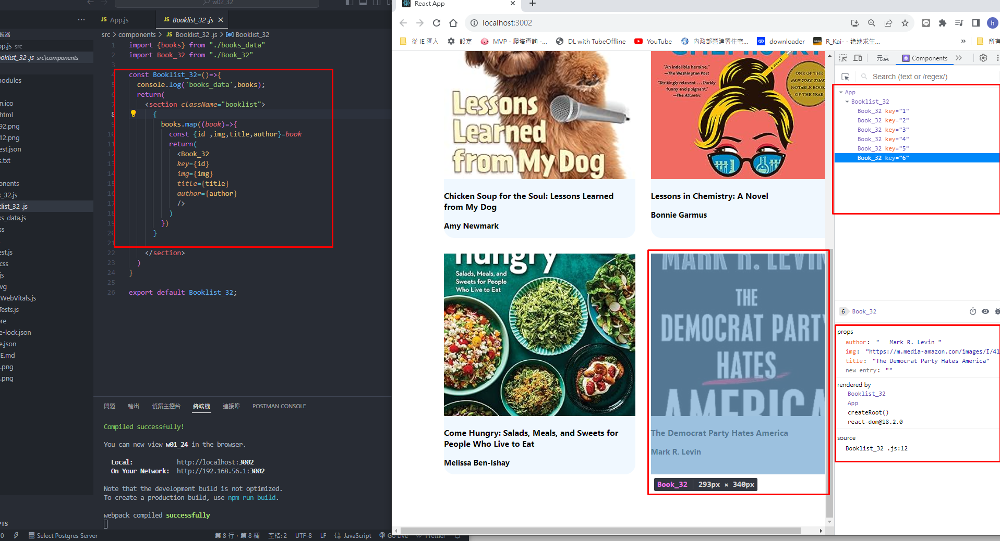
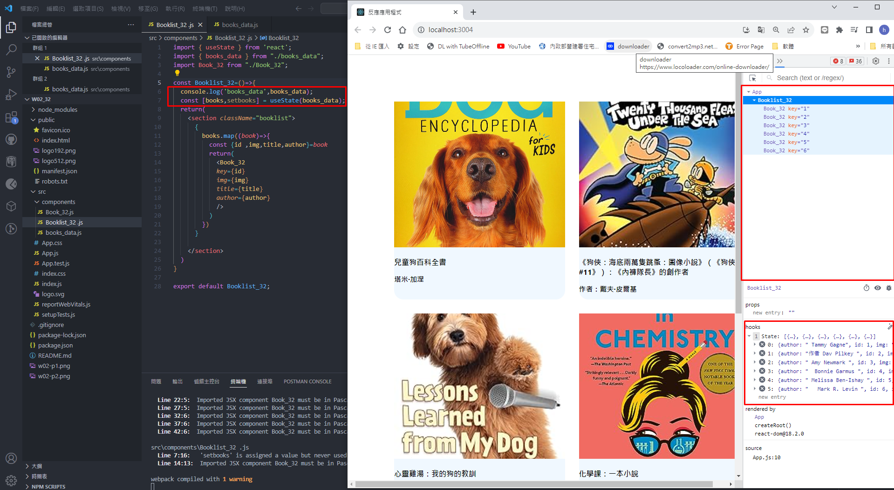

[My Github Repo URL](https://github.com/sies890056/1121-wp1-demo-211418032/tree/main)
### W02-P1 : modify css to make boos responsive


### W02-p2: share Github repo to the teacher and TA



### W02-p3: use <booklist_32> to show all books in book_data.js array



### W02-p4: use useState hook to store all books in books_data.js array



### W02 git logs

```
git log --pretty=format:"%h%x09%an%x09%ad%x09%s" --after="2023-09-19"

5bb6b4e sies890056      Sun Sep 24 23:05:57 2023 +0800  ### w01-p3: display first two book/>
d5c02c4 sies890056      Sun Sep 24 22:29:49 2023 +0800  w01-p2: display first two book/>
bf95c50 sies890056      Sat Sep 23 18:53:03 2023 +0800  create github repo with demo/md/w01_32 directory
3bfa9d4 sies890056      Sat Sep 23 17:15:14 2023 +0800  w01-p1: create github repo with demo/md/w01_32 directory
```