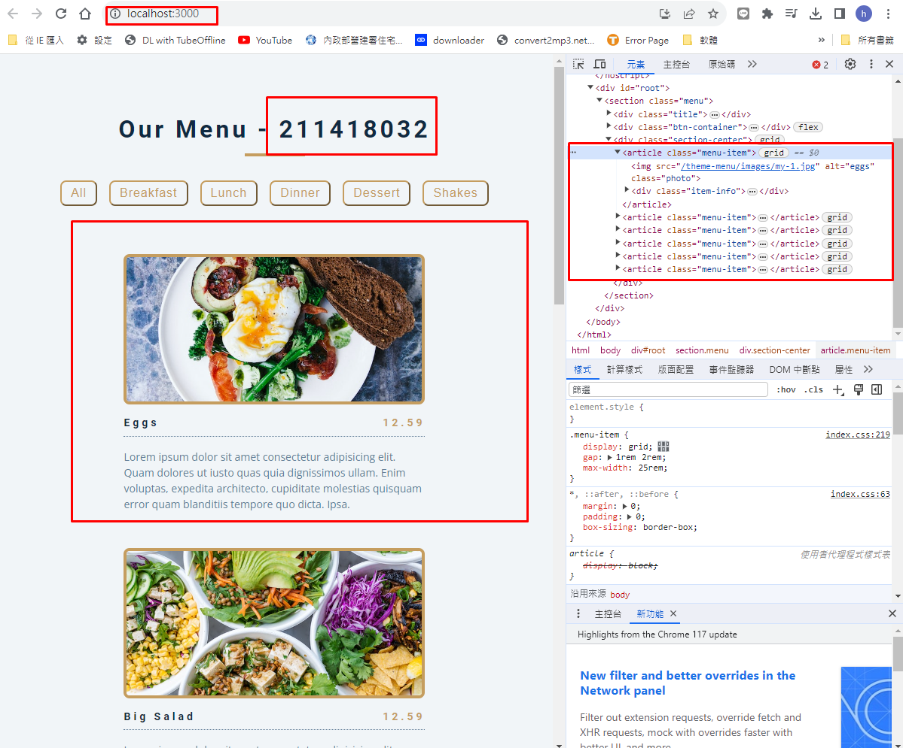
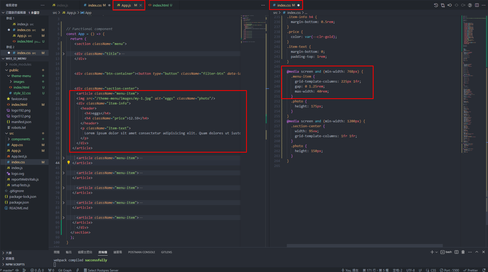

[My Github Repo URL](https://github.com/sies890056/1121-wp1-demo-211418032/tree/main)
### W03-pz : Display all static menus in App.js





### W02-p2: share Github repo to the teacher and TA

![]

### W02-p3: use <booklist_32> to show all books in book_data.js array

![]

### W02-p4: use useState hook to store all books in books_data.js array

![]

### W02 git logs

```
git log --pretty=format:"%h%x09%an%x09%ad%x09%s" --after="2023-09-30"


```