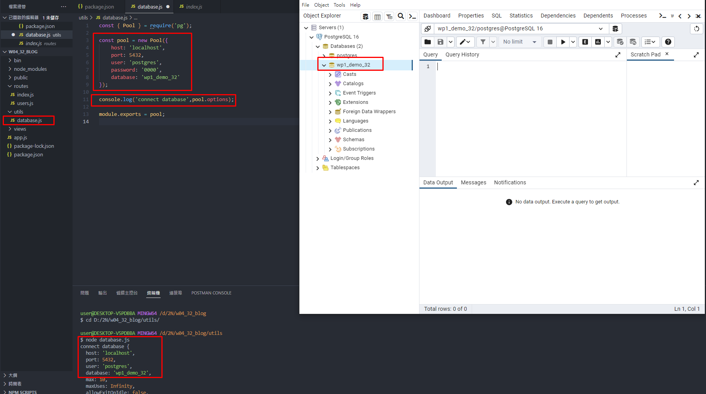
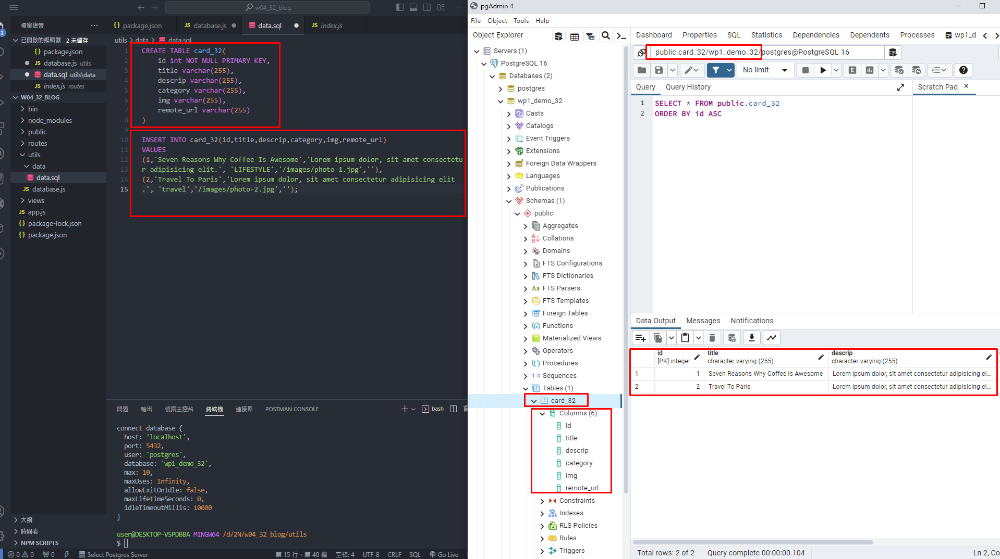
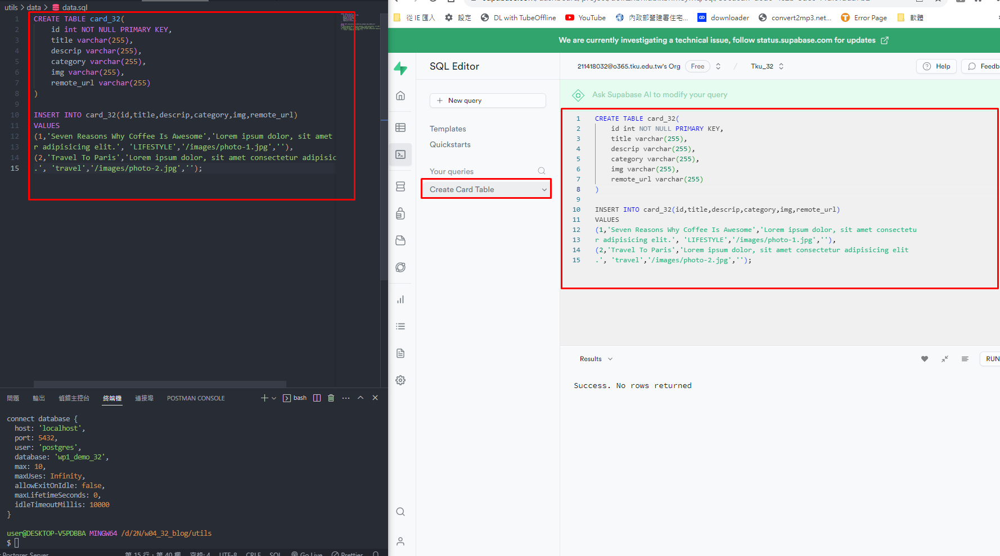
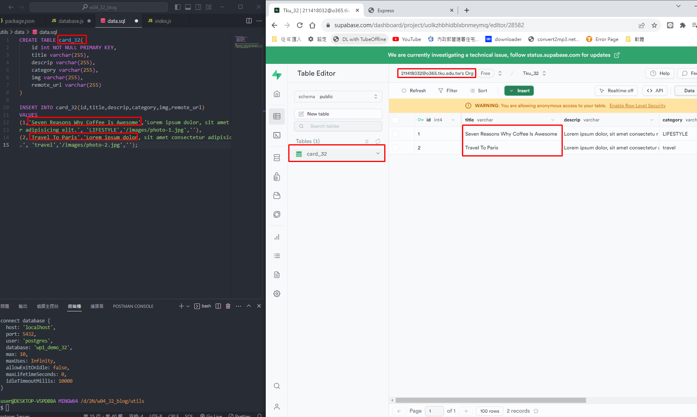
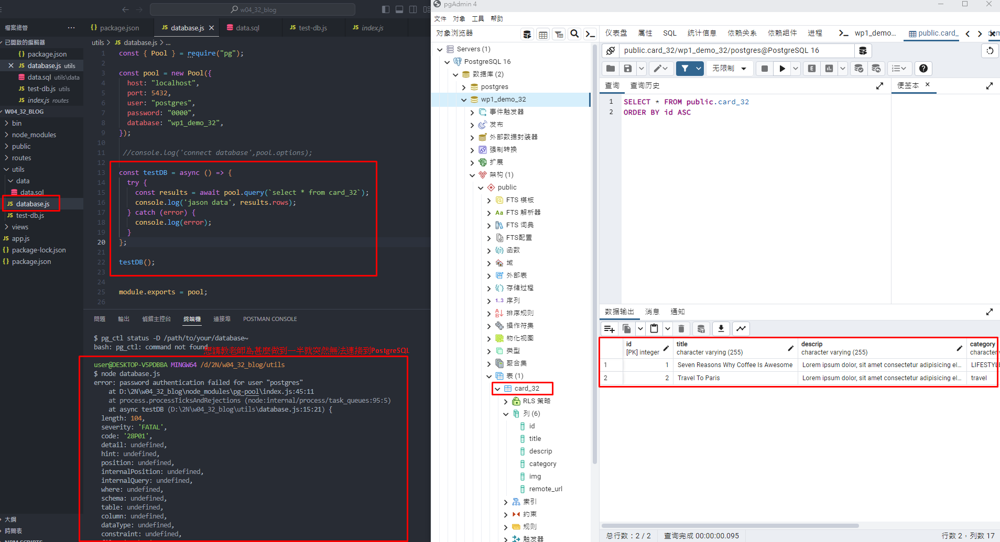
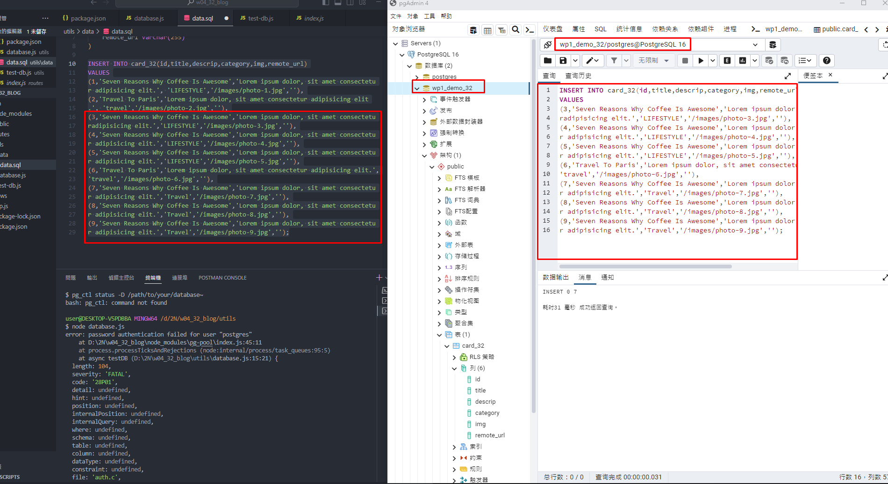
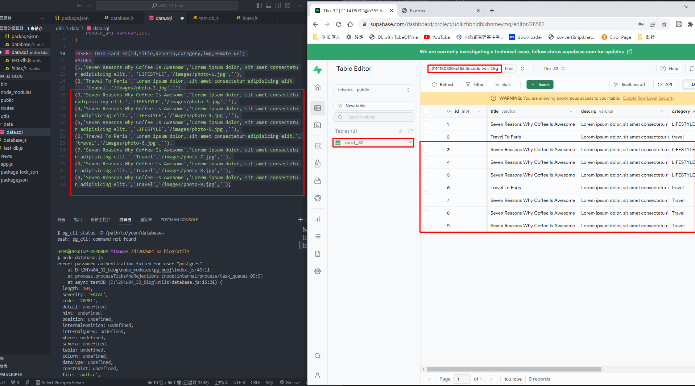
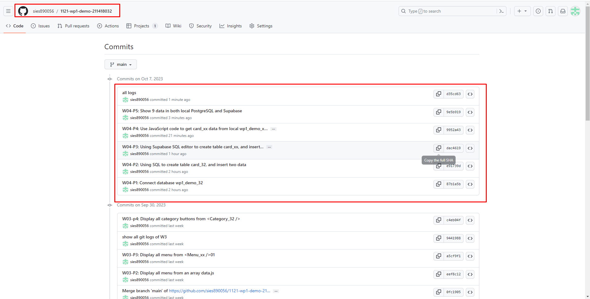

[My Github Repo URL](https://github.com/sies890056/1121-wp1-demo-211418032/tree/main)
### W04-P1: Connect database wp1_demo_32



```
87b1a5b sies890056      Sat Oct 7 13:49:08 2023 +0800   W04-P1: Connect database wp1_demo_32

```
### W04-P2: Using SQL to create table card_32, and insert two data



```
e91739d sies890056      Sat Oct 7 14:37:55 2023 +0800   W04-P2: Using SQL to create table card_32, and insert two data
```
###  W04-P3: Using Supabase SQL editor to create table card_xx, and insert two data




```
dac4619 sies890056      Sat Oct 7 15:14:50 2023 +0800   W04-P3: Using Supabase SQL editor to create table card_xx, and insert two data'
```

### W04-P4: Use JavaScript code to get card_xx data from local wp1_demo_xx databas


```
9952a43 sies890056      Sat Oct 7 16:13:42 2023 +0800   W04-P4: Use JavaScript code to get card_xx data from local wp1_demo_xx databas 

```

### W04-P5: Show 9 data in both local PostgreSQL and Supabase
#### local PostgreSQL
 

 
#### Supabase
 

```

```
9e5b919 sies890056      Sat Oct 7 16:31:53 2023 +0800   W04-P5: Show 9 data in both local PostgreSQL and Supabase


### ### W04-P6: W4 all logs


```
9e5b919 sies890056      Sat Oct 7 16:31:53 2023 +0800   W04-P5: Show 9 data in both local PostgreSQL and Supabase
9952a43 sies890056      Sat Oct 7 16:13:42 2023 +0800   W04-P4: Use JavaScript code to get card_xx data from local wp1_demo_xx databas
dac4619 sies890056      Sat Oct 7 15:14:50 2023 +0800   W04-P3: Using Supabase SQL editor to create table card_xx, and insert two data'
e91739d sies890056      Sat Oct 7 14:37:55 2023 +0800   W04-P2: Using SQL to create table card_32, and insert two data
87b1a5b sies890056      Sat Oct 7 13:49:08 2023 +0800   W04-P1: Connect database wp1_demo_32
d35cd63 sies890056      Sat Oct 7 16:34:01 2023 +0800   all logs

```