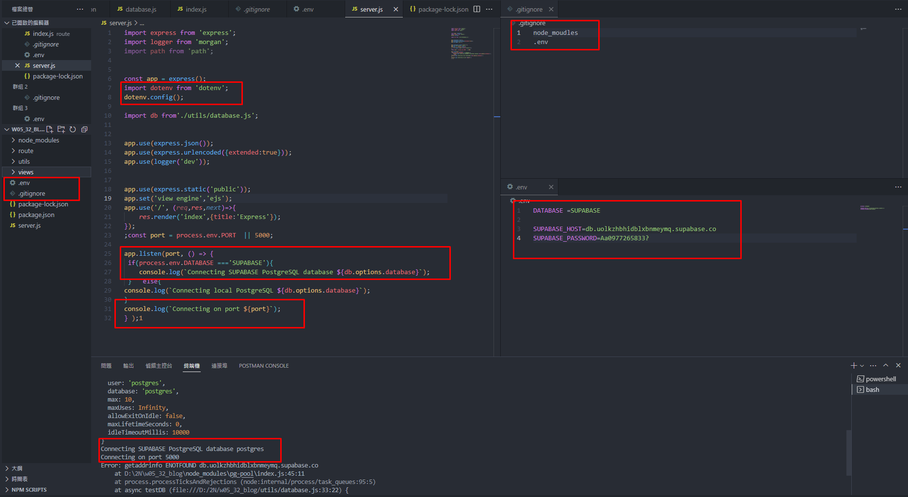
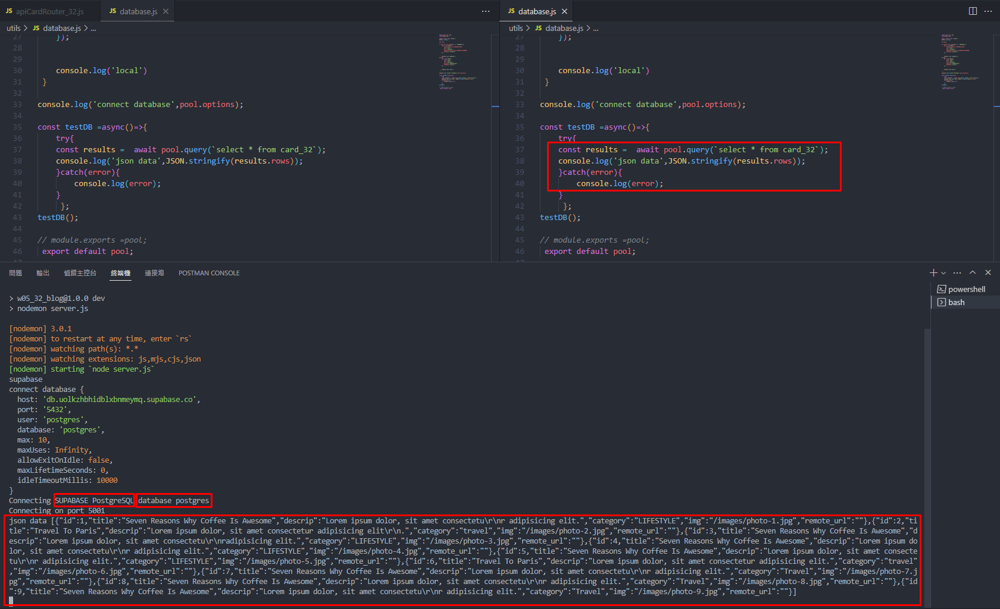

[My Github Repo URL](https://github.com/sies890056/1121-wp1-demo-211418032/tree/main)

### W05-P1: Demo how to use environment variable DATABASE



```
de2c6fd sies890056      Sat Oct 14 14:54:39 2023 +0800  W05-P1: Demo how to use environment variable DATABASE

```
### W05-P2: Using pgAdmin 4 to get table card_xx from Supabase


```
a2c9840 sies890056      Wed Oct 11 20:03:29 2023 +0800  W05-P2: Using pgAdmin 4 to get table card_xx from Supabase
```
### W05-P3: Using database.js to connect to Supabase and show card_xx data



```

```

### 


```


```

### 
 

git log --pretty=format:"%h%x09%an%x09%ad%x09%s" --after="2023-09-19"

```

```


```

```