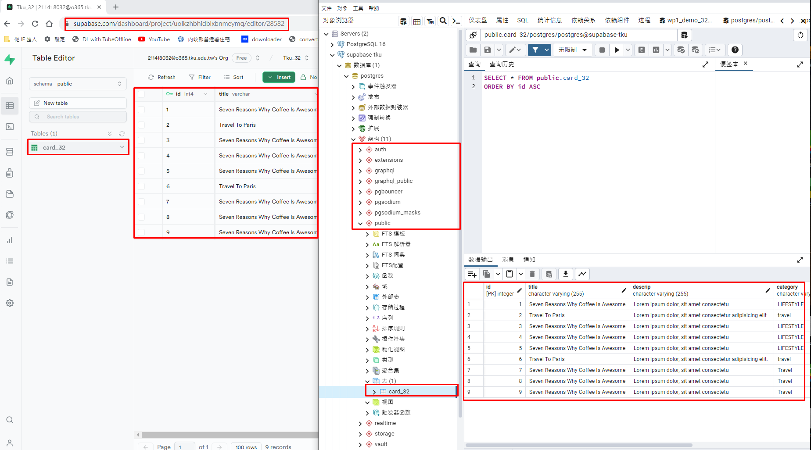

[My Github Repo URL](https://github.com/sies890056/1121-wp1-demo-211418032/tree/main)

### W05-P1: Demo how to use environment variable DATABASE


```


```
### W05-P2: Using pgAdmin 4 to get table card_xx from Supabase



```
a2c9840 sies890056      Wed Oct 11 20:03:29 2023 +0800  W05-P2: Using pgAdmin 4 to get table card_xx from Supabase
```
###  


```

```

### 


```


```

### 
 

 

```

```


```

```