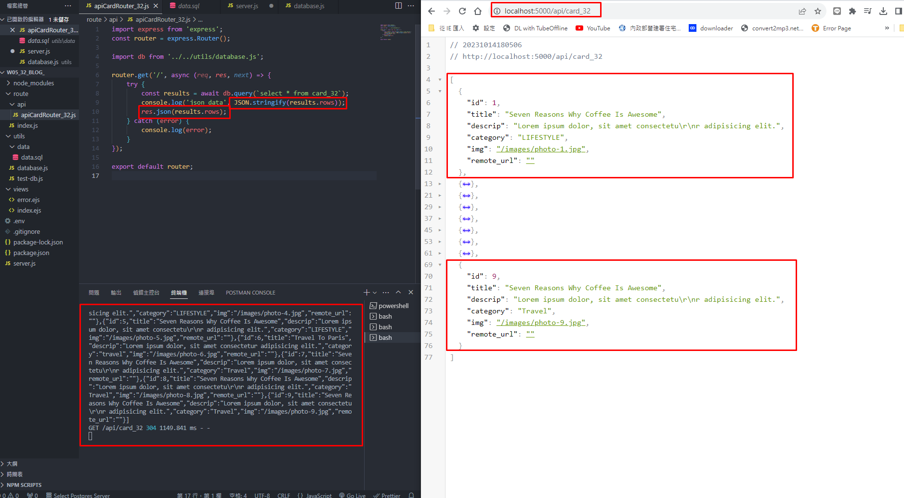
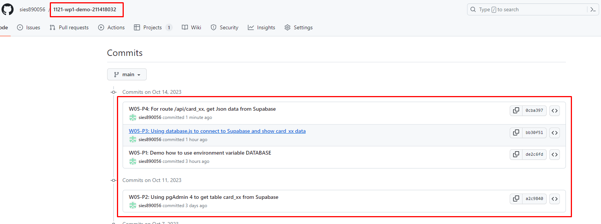

[My Github Repo URL](https://github.com/sies890056/1121-wp1-demo-211418032/tree/main)

### W05-P1: Demo how to use environment variable DATABASE


```
de2c6fd sies890056      Sat Oct 14 14:54:39 2023 +0800  W05-P1: Demo how to use environment variable DATABASE

```
### W05-P2: Using pgAdmin 4 to get table card_xx from Supabase


```
a2c9840 sies890056      Wed Oct 11 20:03:29 2023 +0800  W05-P2: Using pgAdmin 4 to get table card_xx from Supabase
```
### W05-P3: Using database.js to connect to Supabase and show card_xx data


```
bb30f51 sies890056      Sat Oct 14 16:58:10 2023 +0800  W05-P3: Using database.js to connect to Supabase and show card_xx data

```

### W05-P4: For route /api/card_xx, get Json data from Supabase



```
0cba397 sies890056      Sat Oct 14 18:08:54 2023 +0800  W05-P4: For route /api/card_xx, get Json data from Supabase

```

### W05-P5: W5 all logs
 


git log --pretty=format:"%h%x09%an%x09%ad%x09%s" --after="2023-09-19"

```

```
9b34238 sies890056      Sat Oct 14 18:10:59 2023 +0800  W05-P5: W5 all logs
0cba397 sies890056      Sat Oct 14 18:08:54 2023 +0800  W05-P4: For route /api/card_xx, get Json data from Supabase
bb30f51 sies890056      Sat Oct 14 16:58:10 2023 +0800  W05-P3: Using database.js to connect to Supabase and show card_xx data
de2c6fd sies890056      Sat Oct 14 14:54:39 2023 +0800  W05-P1: Demo how to use environment variable DATABASE
a2c9840 sies890056      Wed Oct 11 20:03:29 2023 +0800  W05-P2: Using pgAdmin 4 to get table card_xx from Supabase


```

```