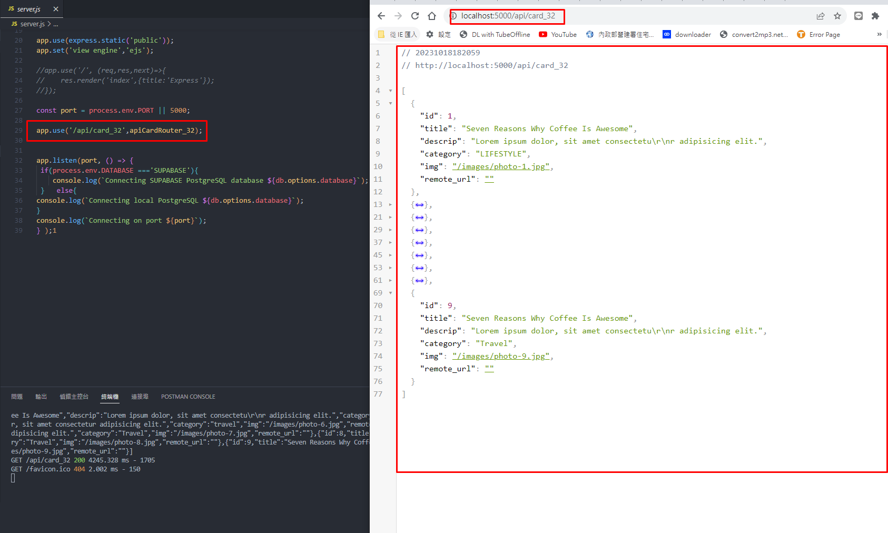
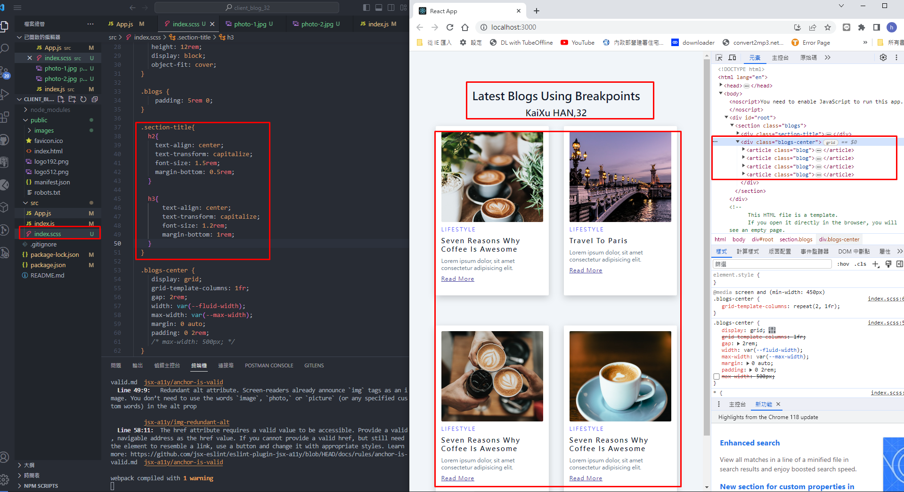
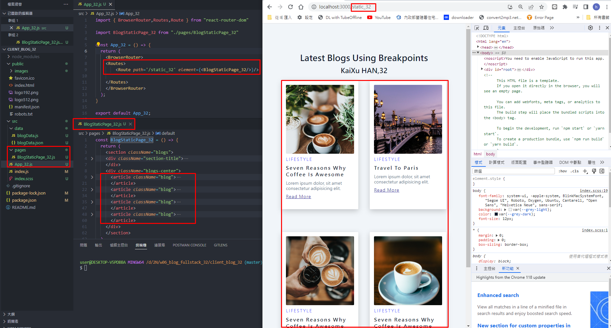
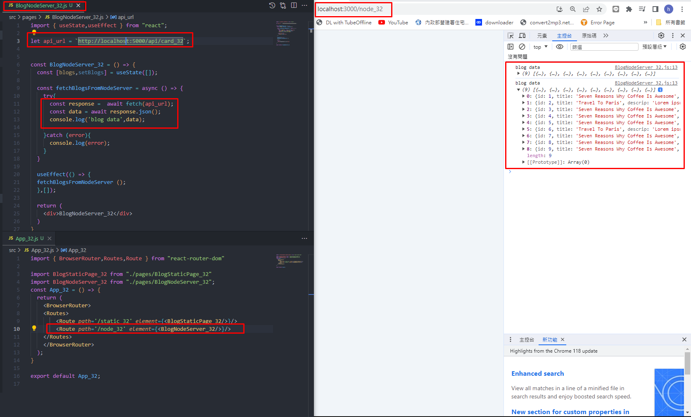
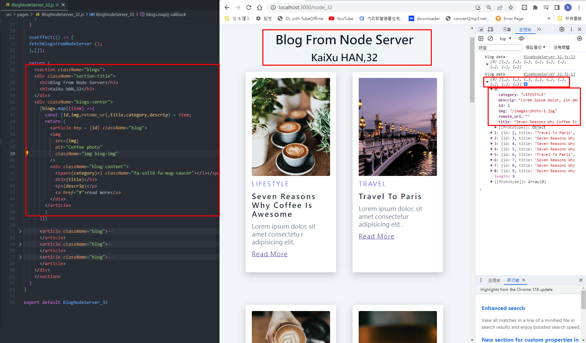

[My Github Repo URL](https://github.com/sies890056/1121-wp1-demo-211418032/tree/main)

### W06-P1: Run the server in W5 using /api/card_32



```
97380d5 sies890056      Wed Oct 18 19:03:28 2023 +0800  ### W06-P1: Run the server in W5 using /api/card_xx
```
### W06-P2: blog html theme convert to React using scss



```
9f69752 sies890056      Sat Oct 21 16:18:39 2023 +0800  W06-P2: blog html theme convert to React using scss
```
### W06-P3: use route /static_32 to show <BlogStaticPage_32 />



```
a34ae8f sies890056      Sat Oct 21 18:27:33 2023 +0800  W06-P3: use route /static_32 to show <BlogStaticPage_32 />

```

###  W06-P4: Fetch data from node server via route /node_32, show data in console.log



```
49af05b sies890056      Sat Oct 21 18:58:00 2023 +0800  W06-P4: Fetch data from node server via route /node_32, show data in console.log

```

### W06-P5: Fetch data from node server via route /node_32, render all blogs data in webpage
 



```

```


```

```

git log --pretty=format:"%h%x09%an%x09%ad%x09%s" --after="2023-09-19"