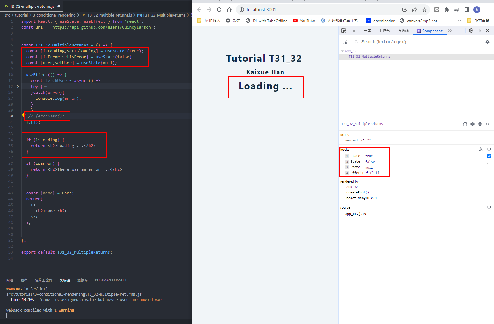
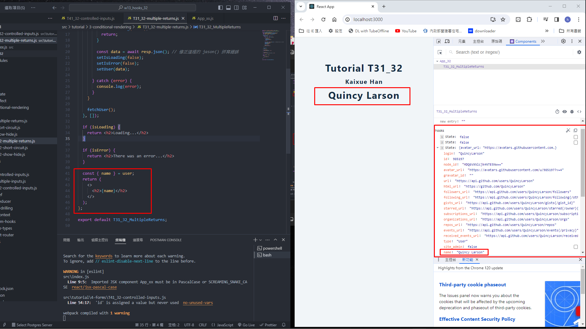
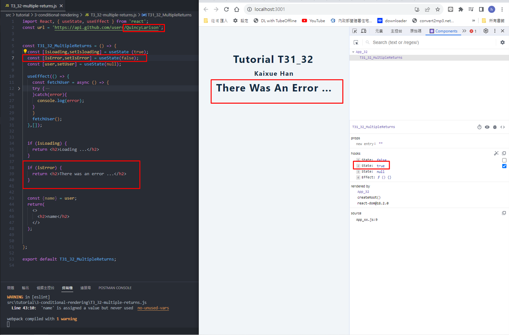
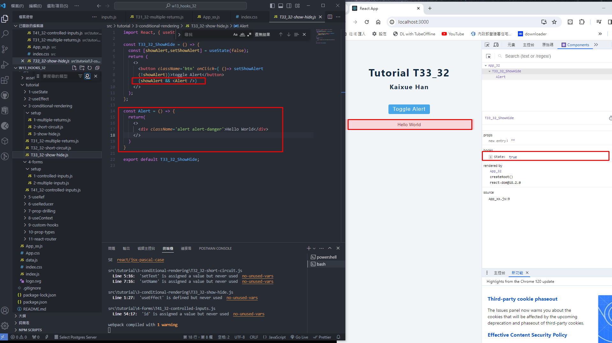
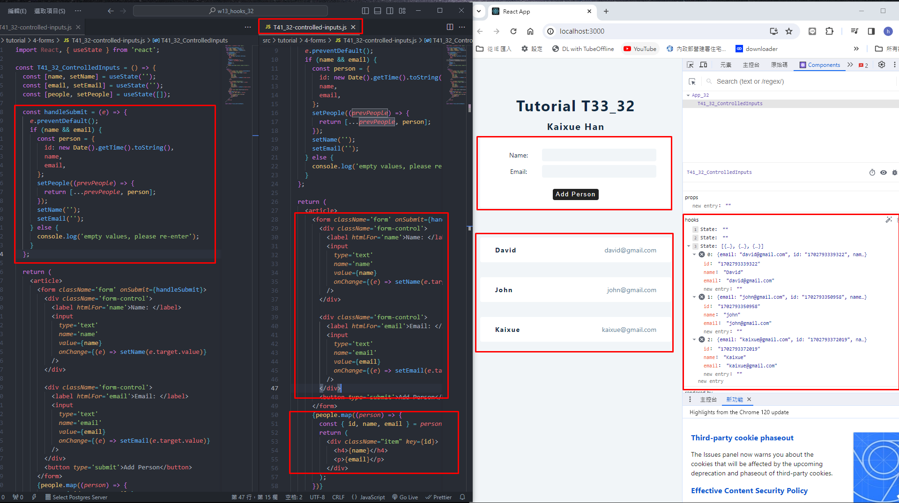

[My Github Repo URL](https://github.com/sies890056/1121-wp1-demo-211418032/tree/main)

### W13-P1: Do T31 conditonal rendering by check isloading, isError, or fetch user data correctly





```
9ba5374 sies890056      Sun Dec 17 13:53:12 2023 +0800  ###W13-P1: Do T31 conditonal rendering by check isloading, isError, or fetch user data correctly

```
### W13-P2: Do T33 toggle alert message



```
f725ed1 sies890056      Sun Dec 17 14:03:46 2023 +0800  ### W13-P2: Do T33 toggle alert message
```
### W13-P3: Do T41 using form by input name and email



```

6fb4ad3 sies890056      Sun Dec 17 14:13:28 2023 +0800  ### W13-P3: Do T41 using form by input name and email
```

### 


```


```

### 
 


```


```


```


```
git log --pretty=format:"%h%x09%an%x09%ad%x09%s" --after="2023-09-19"