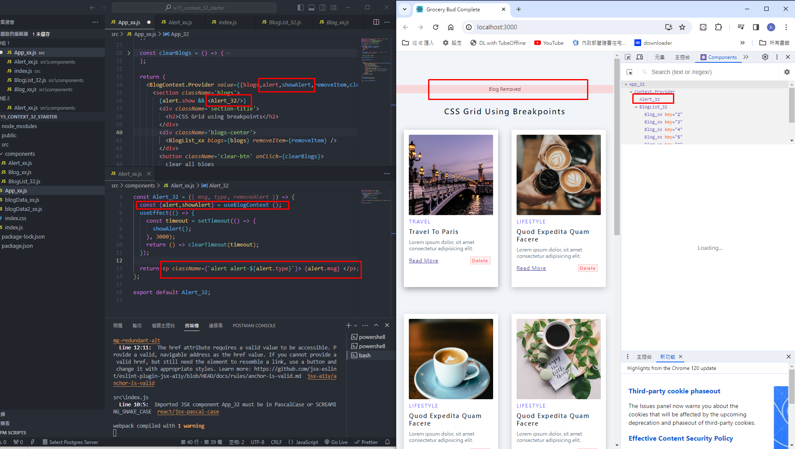

[My Github Repo URL](https://github.com/sies890056/1121-wp1-demo-211418032/tree/main)

### W15-P1: Do T81_32, using context to solve prop drilling of T71_32


```
d792ce0 sies890056      Wed Dec 20 19:28:22 2023 +0800  W15-P1: Do T81_32, using context to solve prop drilling of T71_32

```
### W15-P2: implement Alert_32 using BlogContext provider



```
8a3f189 sies890056      Sat Dec 23 16:36:08 2023 +0800  ### W15-P2: implement Alert_xx using BlogContext provider

```

### W15-P3: Implement BlogList_32 and Blog_32 from BlogContext provider
 


```
c6b5dd9 sies890056      Sat Dec 23 16:59:54 2023 +0800  ### W15-P3: Implement BlogList_xx and Blog_32 from BlogContext provider

```

### 


```


```

### 


```


```


```


```
git log --pretty=format:"%h%x09%an%x09%ad%x09%s" --after="2023-09-19"