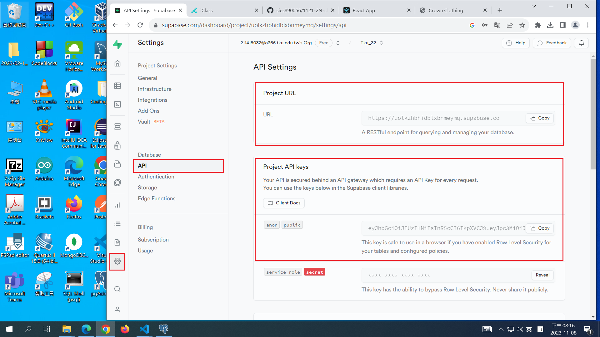

# (12.5%) Web Programming 2N 期中上機考 1 -- 開放網路

##### 2023-11-08, at E201

#### Note:

1. 請不要發揮同學愛，作弊雙方除了本次考試 0 分外，平常分數另扣 20 分。
2. iClass 上請繳交 mid1_xx.md, mid1_xx.pdf，還有 client_mid1_xx.zip, server_mid1_xx.zip, w09_mid1_xx.zip (node_module 請移除，如有需要，移除 /public/img 下所有圖片)
3. 老師將題目提供在 w09_mid1_xx.md 檔上，要實作的部分放在 mid1_htc.pdf 上，請依照老師實作的圖片在你自己的 Github repo, Supabase, Vercel 上實作
4. 每一張圖片要有機房左側背景，要有你的學號，圖片標註要跟老師所標註的類似。違者會依情節扣分。
5. 請自評分數，將每一題的 ? 填入分數，沒有填者，不會批改，以 0 分計算。

##### Your (Name, ID): (?, ?)

##### P1 (30%) -- 基本題

- P1-1 (6%): 6 分
- P1-2 (6%): 6 分
- P1-3 (6%): 6 分
- P1-4 (6%): 6 分
- P1-5 (6%): 6 分

##### P2(40%) -- Backend: Supabase, pgAdmin

- P2-1 (6%): 6 分
- P2-2 (6%): 6 分
- P2-3 (10%): 10 分
- P2-4 (6%): 6 分
- P2-5 (6%): 6 分
- P2-6 (6%): 6 分

###### P3 (30%) -- Frontend: React

- P3-1 (10%): 10 分
- P3-2 (10%): ? 分
- P3-3 (10%): ? 分

##### 總分: 68 分

---

## (30%) P1: Show Info of Your Github Repo, Client Supa Github, Vercel as follows

#### (6%) P1-1: Show Your Github Repo page with all class demos

[My Github Repo URL](https://github.com/sies890056/1121-wp1-demo-211418032.git)


#### (6%) P1-2: Show Your Github commits for week 7


#### (6%) P1-3: Show Your Github URL, deploy to Vercel for Supabase blog demo

[My Github URL for Supabase blog demo]()


#### (6%) P1-4: Show Your Vercel page for Supabase blog demo, with route /supa_xx

[My Vercel URL for Supabase blog demo](https://1121-2-n-client-blog-32.vercel.app/supa_32)


#### (6%) P1-5: Git push P1 with git log


```
git log --pretty=format:"%h%x09%an%x09%ad%x09%s" --after="2023-11-07"

d68c61e htchung Wed Nov 8 04:31:54 2023 +0800   P1-5: Git push P1 with git log
```

---

## (40%) P2: Backend: Node using Supabase & pgAdmin

#### (6%) P2-1: Show connection info in Supabase, and use pgAmdin to connect to Supabase

##### => show connecton info from Supabase


##### => show how to connect to Supabase in pgAdmin


#### (6%) P2-2: 在 pgAdmin 中下 SQL 指令建立 product_xx 資料

##### => 在 local pgAdmin 檢視


##### => 在 Supabase 檢視


#### (10%) P2-3: 在 Supabase 下用 SQL 指令建立 product_xx 資料

請以學號最後一碼除以 5 取餘數取得一個 category，對應到 category id 如下：

Category: 1(hats), 2(jackets), 3(sneakers), 4(womens), 5(mens)

請實作對應 html theme 中該類的產品。舉例，如果是 4(womens)，要實作 womens.html，如果是 0，要實作 mens.html。

以下以 womens.html 來做說明。

##### => jackets.html


##### => 在 Supabase 下用 SQL Editor 下 SQL 指令


##### => 要能顯示 pid, category_id, price, local_img_url, remote_img_url


#### (6%) P2-4: 透過 Supabase，取得 Project URL 和 anon key



#### (6%) P2-5: 解析 anon key，用 JWT secret 來確認 anon key 是正確的


#### (6%) P2-6: 透過 Supabase，取得如何呼叫讀取 product_xx 所有資料的方法


---

## (30%) P3: React Using Supabase

#### (10%) P3-1: 將 P2-3 靜態頁面轉成 React 頁面，放在 pages/mid1_xx/Mid1StaticPage_xx.js，透過路由 route /mid1_static_xx 可以顯示。


##### => 顯示程式碼，可以看到有多少筆 product 資料 (某些 code 要內收)


#### (10%) P3-2: 藉由 P2-6 Supabase 之存取方式，取得 product_xx 中所有資料，並透過路由 /mid1_supa_product_xx 顯示在 pages/mid1_xx/Mid1SupaPage_xx.js 中。


##### => code for fetching products data


##### => code for rendering products data


#### (10%) P3-3: 透過路由 /mid1_supa2_xx 到 Supabase 讀取 card_xx 中某個 category 的資料，以你的學號最後一碼對應到 card_xx 之 id，取得該筆資料的 category，如果是 0，則選 id = 1。顯示頁面是 pages/mid1_xx/Mid1Supa2Page_xx.js。

Hint: 請自行查 Supabase API doc，要如何存取符合某些欄位的資料

##### => Supabase API doc


##### => Supabase 上該 category 資料


##### => 瀏覽器顯示 category 資料，要用 React DevTools Components 來顯示讀到的資料


##### => code for fetching category data


